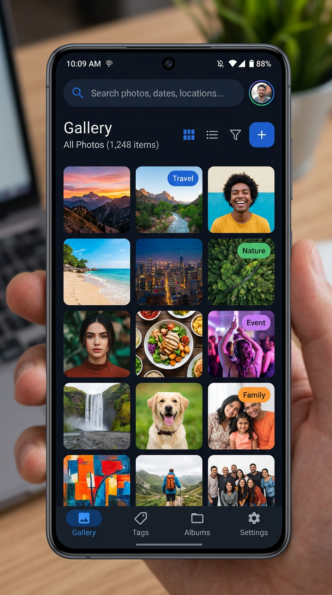
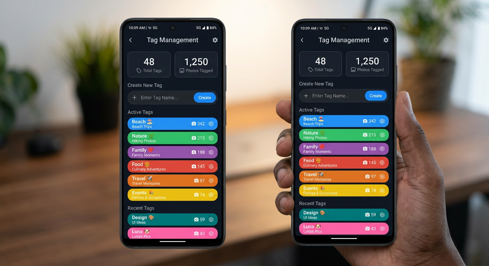
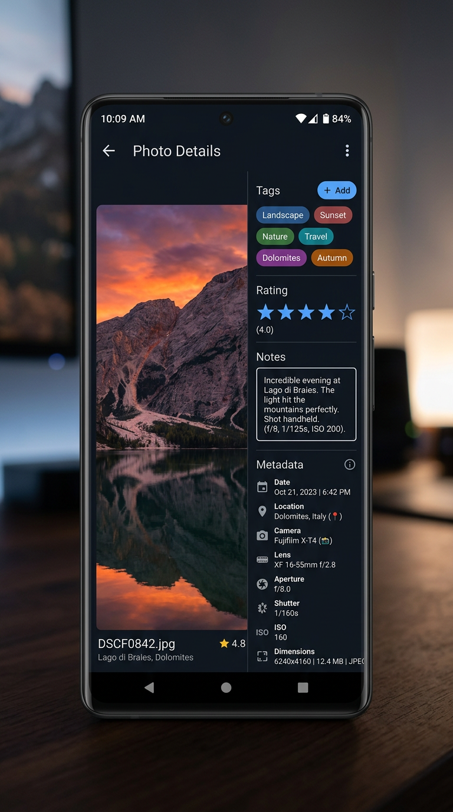

<p align="center">
  
</p>

<h1 align="center">Stash Photos</h1>

<p align="center">
  <strong>Tag & organize your Google Photos — inspired by <a href="https://github.com/stashapp/stash">Stash</a></strong>
</p>

<p align="center">
  <a href="#features">Features</a> •
  <a href="#screenshots">Screenshots</a> •
  <a href="#setup">Setup</a> •
  <a href="#install-apk">Install APK</a> •
  <a href="#development">Development</a> •
  <a href="#architecture">Architecture</a>
</p>

---

## About

Stash Photos is a Progressive Web App (PWA) and Android app that connects to your **Google Photos** library and gives you a powerful **tagging and organization** system — all stored locally on your device.

Think of it as the organization power of [Stash](https://github.com/stashapp/stash), but for your personal Google Photos.

## Features

### 🏷️ Tagging & Organization
- Create **color-coded tags** with custom names
- Organize tags into **categories** for hierarchical grouping
- **Multi-tag** any photo — assign multiple tags per image
- See **tag counts** — how many photos have each tag
- **Filter your gallery** by one or more tags simultaneously

### 📸 Google Photos Integration
- **Read-only** access to your Google Photos library via the official API
- **Infinite scroll** gallery with lazy-loaded thumbnails
- **Browse albums** from your Google Photos account
- **Full-size viewing** with photo metadata (date, camera, dimensions)
- **Video playback** support

### ⭐ Photo Management
- **5-star ratings** per photo
- **Personal notes** attached to any photo
- **EXIF-style metadata** display (creation date, camera make/model, resolution)
- **Quick link** to open any photo directly in Google Photos

### 📱 Cross-Platform
- **PWA** — install on any device from Chrome/Safari (Add to Home Screen)
- **Android APK** — native app wrapper via Capacitor
- **Dark theme** optimized for OLED screens
- **Responsive** — works on phones, tablets, and desktops

### 🔒 Privacy-First
- All tags, ratings, and notes stored **locally in IndexedDB**
- No data sent anywhere except Google Photos API for fetching your library
- **Export/Import** your tag data as JSON backup
- No accounts, no servers, no tracking

## Screenshots

<p align="center">
  
  
  
</p>

<p align="center">
  <em>Gallery with tag overlays • Tag manager with categories • Photo detail with tagging panel</em>
</p>

## Setup

### Step 1: Google Cloud Console Setup

You need a **Google Cloud OAuth 2.0 Client ID** to connect to Google Photos:

1. Go to [Google Cloud Console](https://console.cloud.google.com)
2. **Create a new project** (or select an existing one)
3. Enable the [**Photos Library API**](https://console.cloud.google.com/apis/library/photoslibrary.googleapis.com)
4. Configure the **OAuth consent screen**:
   - Go to **APIs & Services → OAuth consent screen**
   - Choose **External** user type
   - Fill in app name and support email
   - Skip scopes for now (we'll add them later)
   - Add your email as a **Test user** under the **Audience** tab
5. Create credentials:
   - Go to **APIs & Services → Credentials**
   - Click **Create Credentials → OAuth 2.0 Client ID**
   - Application type: **Web application**
   - Name: "Stash Photos"
   - Under **Authorized JavaScript origins**, add:
     - `http://localhost:5173` (for local dev)
     - `https://localhost` (for Android APK)
   - Under **Authorized redirect URIs**, add:
     - `https://backip210-pixel.github.io/google_stash/oauth-redirect.html` (for Android APK)
   - Click **Create** and copy the **Client ID**

### Step 2: Enable GitHub Pages (for Android APK)

The Android APK uses a hosted redirect page for OAuth. You need to enable GitHub Pages:

1. Go to [Repo Settings → Pages](https://github.com/backip210-pixel/google_stash/settings/pages)
2. Under **Source**, select **Deploy from a branch**
3. Branch: **main**, Folder: **/ (root)**
4. Click **Save**
5. Wait ~1 minute for it to deploy

### Web App (PWA)

```bash
# Clone the repo
git clone https://github.com/backip210-pixel/google_stash.git
cd google_stash

# Install dependencies
npm install

# Start dev server
npm run dev

# Open http://localhost:5173
```

### First Launch (Web or Android)
1. Open the app
2. Click **Configure Client ID →**
3. Paste your OAuth 2.0 Client ID
4. Click **← Back to Login**
5. Click **Sign in with Google**
6. Sign in with your Google account
7. Grant Photos Library access
8. Your photos will load! Start tagging!

## Install APK

### Option A: Download Pre-built APK
1. Go to [GitHub Actions](https://github.com/backip210-pixel/google_stash/actions)
2. Click the latest successful build
3. Scroll to **Artifacts** → click **StashPhotos-APK**
4. Unzip the downloaded file to get `app-debug.apk`

### Option B: Build Locally
```bash
# Requires JDK 21+ and Android SDK
npm install
npm run build
npx cap sync android
cd android && ./gradlew assembleDebug
# APK at: android/app/build/outputs/apk/debug/app-debug.apk
```

### Installing on Android
1. Transfer the APK to your phone (email, Google Drive, USB, etc.)
2. Enable **Install from Unknown Sources**:
   - Android 8+: Settings → Apps → Special app access → Install unknown apps → [Your browser/file manager] → Allow
   - Android 7 and below: Settings → Security → Unknown sources → Enable
3. Tap the APK file to install
4. Open the app
5. Configure your Google Cloud Client ID (see Step 1 above)
6. Sign in with Google

### Troubleshooting

**"Google Auth not initialized" error:**
- Make sure you've entered a valid Client ID in Settings
- The Client ID should look like: `123456789-abc123.apps.googleusercontent.com`

**"redirect_uri_mismatch" error:**
- Go to Google Cloud Console → Credentials → your OAuth Client ID
- Under **Authorized redirect URIs**, add: `https://backip210-pixel.github.io/google_stash/oauth-redirect.html`
- Also add `https://localhost` under **Authorized JavaScript origins**

**"access_denied" or "app not verified" error:**
- Go to Google Cloud Console → OAuth consent screen → Audience tab
- Add your Google email (e.g., `yourname@gmail.com`) as a **Test user**
- Save and try again

**No photos showing up:**
- Check the browser console (Chrome DevTools) for API errors
- Make sure the Photos Library API is enabled in Google Cloud Console
- Try signing out and back in

**Status bar overlapping buttons:**
- This is fixed in the latest version with proper safe area padding
- If you still see it, try uninstalling and reinstalling the APK

## Development

### Tech Stack

| Layer | Technology |
|-------|-----------|
| Framework | React 19 + TypeScript |
| Build Tool | Vite 8 |
| Styling | Tailwind CSS 4 |
| Database | IndexedDB via Dexie.js |
| Auth | Google Identity Services (OAuth 2.0) |
| Photos API | Google Photos Library REST API |
| Icons | Lucide React |
| Android Wrapper | Capacitor 7 |

### Project Structure

```
google_stash/
├── src/
│   ├── App.tsx              # Main app + routing
│   ├── auth/
│   │   └── googleAuth.ts    # Google OAuth 2.0 (implicit flow)
│   ├── api/
│   │   └── photosApi.ts     # Google Photos Library API client
│   ├── db/
│   │   └── database.ts      # IndexedDB schema (tags, ratings, notes)
│   ├── components/
│   │   ├── Header.tsx        # Navigation, search, tag filter bar
│   │   ├── Gallery.tsx       # Photo grid with infinite scroll
│   │   ├── PhotoDetail.tsx   # Full photo view + tagging sidebar
│   │   ├── TagManager.tsx    # Tag/category CRUD, stats dashboard
│   │   ├── AlbumsView.tsx    # Google Photos album browser
│   │   └── Settings.tsx      # Client ID config, data export/import
│   └── types/
│       └── index.ts          # TypeScript definitions
├── android/                  # Capacitor Android project
├── .github/workflows/        # CI: auto-build APK on release
├── assets/                   # Logo, screenshots
├── public/
│   ├── manifest.json         # PWA manifest
│   └── icon-*.png            # App icons
└── capacitor.config.ts       # Capacitor configuration
```

### Available Scripts

```bash
npm run dev          # Start dev server
npm run build        # Production build
npm run preview      # Preview production build
npx cap sync         # Sync web build to Android
npx cap open android # Open in Android Studio
```

## Architecture

```
┌─────────────┐     OAuth 2.0      ┌──────────────────┐
│   Google     │ ◄────────────────► │   Google Photos   │
│   Sign-In    │                    │   Library API     │
└──────┬───────┘                    └────────┬─────────┘
       │                                     │
       ▼                                     ▼
┌─────────────────────────────────────────────────────┐
│                 Stash Photos App                      │
│                                                       │
│  ┌──────────┐  ┌──────────┐  ┌──────────────────┐  │
│  │  Auth     │  │  Gallery  │  │  Tag Manager     │  │
│  │  Module   │  │  View     │  │  (create/edit)   │  │
│  └──────────┘  └──────────┘  └──────────────────┘  │
│                                                       │
│  ┌──────────────────────────────────────────────┐    │
│  │         IndexedDB (Dexie.js)                  │    │
│  │  • Tags        • Photo-Tag associations       │    │
│  │  • Categories  • Ratings & Notes              │    │
│  └──────────────────────────────────────────────┘    │
│                                                       │
│  ┌──────────────────────────────────────────────┐    │
│  │         Capacitor (Android)                   │    │
│  │  WebView wrapper → native APK                 │    │
│  └──────────────────────────────────────────────┘    │
└─────────────────────────────────────────────────────┘
```

## Known Limitations

- **Read-only**: The Google Photos API doesn't allow writing tags/labels back to photos
- **Local-only data**: Tags/ratings/notes live in your browser's IndexedDB — clearing browser data deletes them (use Export Data as backup)
- **OAuth scope**: Uses `photoslibrary.readonly` — cannot upload or modify photos

## Roadmap

- [ ] Google Photos Picker API integration for batch photo selection
- [ ] Smart tag suggestions based on photo metadata & EXIF data
- [ ] Bulk tagging (select multiple photos → apply tags at once)
- [ ] Tag-based virtual albums/collections
- [ ] Release-signed APK builds via GitHub Actions
- [ ] Photo duplicate detection
- [ ] Import/export tag data as JSON
- [ ] Multi-language support
- [ ] Auto-sync tags to photo descriptions (when API allows)

## License

MIT

---

<p align="center">
  Built with ❤️ using React, Capacitor & Google Photos API
</p>
